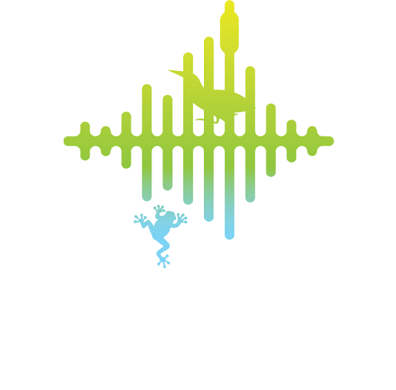

+++
title = "Home"
date = 2023-01-01T08:00:00-07:00
draft = false
+++

<!--
    Hero image is a stock image from adobe stock images
    https://images.app.goo.gl/41SYSDnxCKGj9Bku7

    I originally pulled the image from the host website
    (eavesdroppingonwetlandbirds.com.au)
-->






The Australasian Bittern is a threatened species that are difficult to find and
identify due to their natural camouflage into wetland environments. Our team
aims to track and identify the Australasian Bittern's distinct calls.




    

        <h2>Research Objectives</h3>
        

            By helping identify Bittern calls, you're contributing to a growing
            library of acoustic data that:
        

        <ul>
            <li>
                Better understand the distribution of little-known wetland bird
                species in south-eastern Australia
            </li>
            <li>Improve artificial intelligence training datasets</li>
            <li>Determining the presence or absence of bird species</li>
            <li>
                Contributes to research projects trialing the large-scale
                deployment of acoustic sensors with manual data collection
            </li>
        </ul>
    






## About the group





### Dr Elizabeth (Liz) Znidersic

Dr Elizabeth (Liz) Znidersic is a post-doctoral researcher with Charles Sturt
University. Her major research interests include survey methodologies and the
application of technological tools to monitor individual species and ecosystems,
wetland species and their management and island biodiversity and species
reintroductions/translocations. Liz’s research has led her into the wetlands of
Australia and the USA, searching for some the most secretive wetland birds using
acoustic and motion-activated camera monitoring. She has worked extensively in
the field as a ranger, field ecologist and environmental educator with
nature-based tourism.

<sl-button href="https://www.csu.edu.au/research/ilws/team/profiles/members/elizabeth-znidersic" pill>
    See Profile
</sl-button>


<--->



### Dr Michael Towsey

Dr Michael Towsey uses machine learning methods to solve biological problems.
These have ranged from the sublime (analysis of bird song) to the ridiculous
(analysis of milk yield in cow herds) with some bioinformatics in between!
Michael works on the ‘big data’ problems associated with long duration
recordings of the environment, in particular, building recognizers for species
of interest, extracting acoustic indices to aid navigation and visualisation.
He is currently submerged in the sounds of wetlands.

<sl-button href="https://www.csu.edu.au/research/ilws/team/research-members" pill>
    See Profile
</sl-button>


<--->


### Professor David Watson

Professor David M Watson’s research falls into three principal areas: managing
biodiversity in agricultural landscapes; measuring and predicting the biological
effects of habitat fragmentation; and the ecology of parasitic plants. His
research has been conducted through detailed community-level field studies in
Australia and Latin America; species-specific studies of distribution and
abundance; theoretical advances; empirical studies based on previously published
data; & synthetic reviews consolidating existing information and proposing new
hypotheses.

<sl-button href="https://www.csu.edu.au/research/ilws/team/profiles/members/david-watson" pill>
    See Profile
</sl-button>



